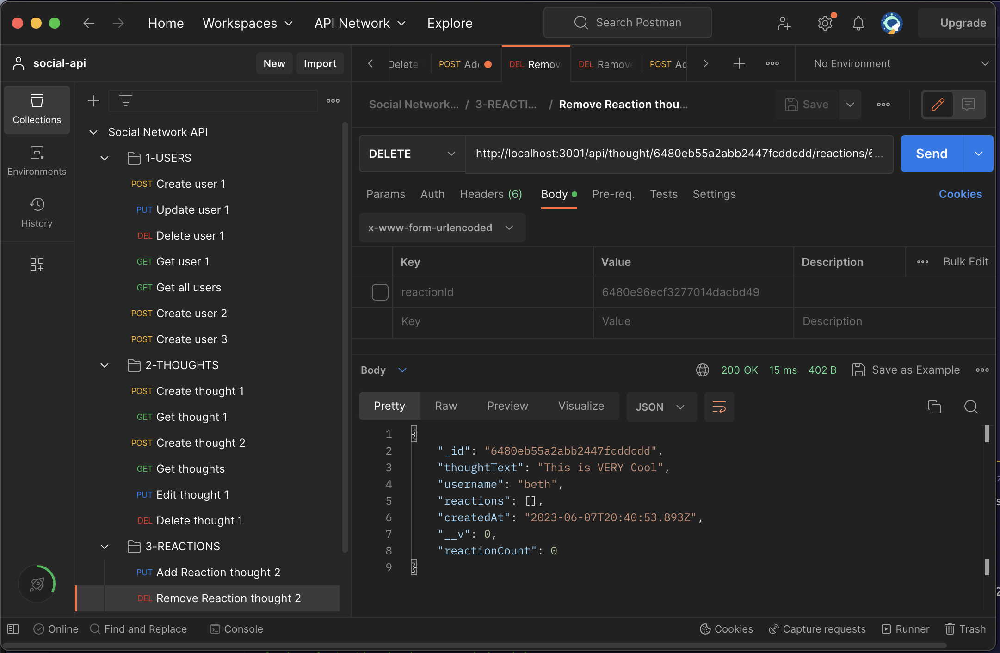

# Social Network API

## Description
This is an API for a social network web application where users can share their thoughts, react to friends' thoughts, and create a friend list. It is built using Express.js for routing, MongoDB for the database, and Mongoose as the ODM. The API provides various routes to perform CRUD operations on users, thoughts, reactions, and friendships.

## Table of Contents
- [Usage](#usage)
- [Credits](#credits)
- [Features](#features)
- [Access](#access)

## Usage
- The server can be launched with the following command
```
node server.js
```
- The APIs can be tested in Postman




## Credits
This API was developed as a project for the NoSQL module of a coding bootcamp. 

## Features
The Social Network API provides the following features:

- User management: Create, update, delete, and retrieve users.
- Thought management: Create, update, delete, and retrieve thoughts.
- Reaction management: Create and delete reactions to thoughts.
- Friendship management: Add and remove friends from a user's friend list.

## Access
[Click to View Repository](https://github.com/johnpow/social-network-api)

[Click for the Video Walkthrough](https://drive.google.com/file/d/1Yi6w56-xoeKDSSdiM-3wLsbgUblhmjzt/view)
